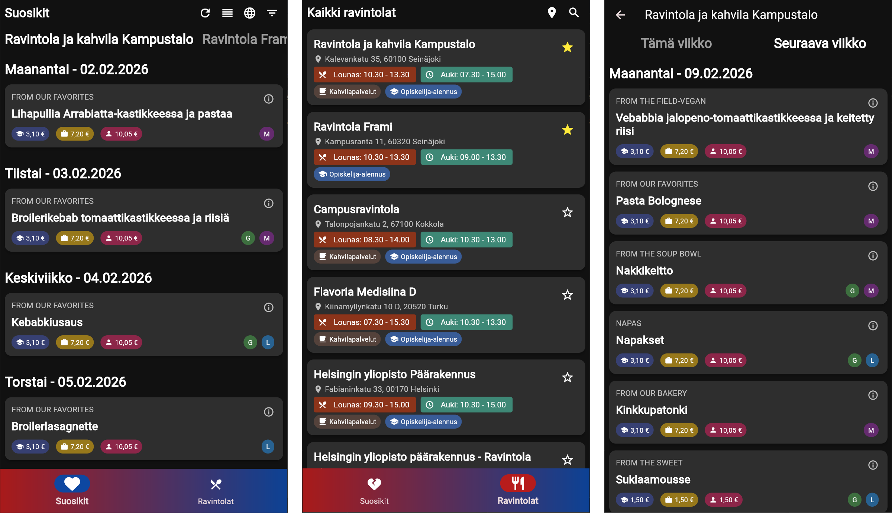

<div align="center">
    <br />
    
  <h3 align="center">SDX Restaurant Menus</h3>
  <h4 align="center">Your daily lunch companion for Sodexo restaurants in Finland</h4>
    <br />
    <br />
</div>



## 🍽️ About the Project

SDX Restaurant Menus is a cross-platform application that makes finding your daily lunch easier by providing quick access to menu information from Sodexo restaurants across Finland. Whether you're a student looking for the closest campus cafeteria, an office worker checking what's for lunch today, or someone exploring dining options in your area, this app has you covered.

The app connects directly to Sodexo's public menu API to fetch up-to-date lunch menus for over 100 restaurants, including student cafeterias, office lunch restaurants, and café locations throughout the country.

**🌐 Try it now:** [sdx.koodattu.dev](https://sdx.koodattu.dev)

## ✨ Key Features

### Browse & Discover

- **Comprehensive Restaurant List** - Access menus for 100+ Sodexo restaurants across Finland
- **Smart Search** - Quickly find restaurants by name or location
- **Filter by Type** - Browse by restaurant category (student cafeterias, lunch restaurants, cafés)
- **Location-Based Sorting** - Find the nearest restaurants based on your current location

### Menu Viewing

- **Weekly Menus** - View complete meal offerings for the entire week
- **Daily Details** - See today's lunch options at a glance
- **Historical & Upcoming Menus** - Browse past weeks or plan ahead by checking future menus
- **Course Filtering** - Hide or show specific menu categories based on your preferences

### Personalization

- **Favorites System** - Save your go-to restaurants for instant access
- **Custom Ordering** - Arrange your favorite restaurants in your preferred order
- **Persistent Preferences** - Your favorites and settings are saved across sessions

### User Experience

- **Modern Dark Theme** - Easy on the eyes with Material Design 3
- **Responsive Design** - Works seamlessly on mobile devices and web browsers
- **Intuitive Navigation** - Simple, user-friendly interface for quick menu browsing

## 🛠️ Technology

This project is built with modern cross-platform technologies:

- **Flutter** - Cross-platform UI framework enabling deployment to mobile (iOS/Android), web, and desktop
- **Dart** - Programming language powering the application logic
- **Sodexo Public API** - Real-time menu data source
- **Python** - Automated scripts for maintaining restaurant data and metadata

The app leverages Flutter's capabilities to provide a native experience across multiple platforms from a single codebase, with the web version deployed and accessible at [sdx.koodattu.dev](https://sdx.koodattu.dev).

## 📁 Project Structure

```
sodexo-flutter-lunch-app/
├── flutter-app/         # Main Flutter application
│   ├── lib/            # Application source code
│   │   ├── models/     # Data models for restaurants and menus
│   │   ├── pages/      # UI screens and pages
│   │   ├── providers/  # State management
│   │   ├── services/   # API communication layer
│   │   └── widgets/    # Reusable UI components
│   └── assets/         # Restaurant data and resources
├── python-scripts/     # Maintenance scripts for restaurant data
└── docs/              # Web deployment build
```

## 🚀 Getting Started

The easiest way to use the app is to visit the web version at [sdx.koodattu.dev](https://sdx.koodattu.dev).

For developers interested in running the project locally:

1. Ensure Flutter SDK is installed on your system
2. Navigate to the `flutter-app` directory
3. Run `flutter pub get` to install dependencies
4. Launch with `flutter run` for your target platform

## 📊 Data Maintenance

The `python-scripts` directory contains automated scripts that scrape and maintain the restaurant database, including:

- Restaurant names and locations
- Operating hours and lunch serving times
- Geographic coordinates for location-based features
- Restaurant categorization (student, lunch, café)

This ensures the app has accurate, up-to-date information about all available Sodexo locations.

## 🎯 Use Cases

- **Students** - Find the nearest campus cafeteria and check today's menu before heading to lunch
- **Office Workers** - Discover what's available at your workplace restaurant or nearby options
- **Menu Planning** - Check menus in advance to plan your week
- **Exploring Options** - Find new Sodexo restaurants in areas you're visiting

## 🙏 Acknowledgments

- **[Sodexo Finland](https://www.sodexo.fi/)** - For providing public access to menu data
- All the Sodexo restaurants serving delicious meals daily

## 👤 Author

**Juha Ala-Rantala**
GitHub: [@Koodattu](https://github.com/Koodattu/)

## 📄 License

This project is distributed under the MIT License. See the [LICENSE](LICENSE) file for more information.

---

<div align="center">
  <sub>Built with ❤️ using Flutter</sub>
</div>
